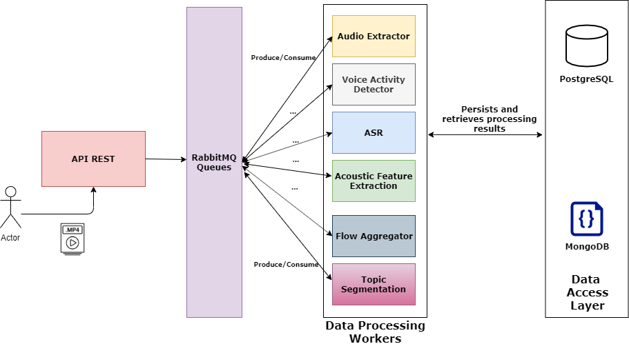

# easytopic :man_teacher:

## Description
``easytopic`` is a versatile architecture for automatically performing topic segmentation on video lectures. 

Video lectures are very popular nowadays. Following the new teaching trends, people are increasingly seeking educational videos on the web
for the most different purposes: learn something new, review content for exams or just out of curiosity. Unfortunately, finding specific
content in this type of video is not an easy task. Many video lectures are extensive and cover several topics, and not all of these topics
are relevant to the user who has found the video. The result is that the user spends so much time trying to find topic of interest in the
middle of content irrelevant to him. The temporal segmentation of video lectures in topics can solve this problem allowing users to
navigate of a non-linear way through all topics of a video lecture. However, temporal video lecture segmentation is not an easy task
and needs to be automatized.


And that's where ``easytopic`` comes in. The architecture provides the entire processing pipeline from feature extraction to
timestamp topic detection. The use of only extracted audio features automatically makes it a versatile approach that can be employed in
a large universe of video lectures, as it does not depend on the availability of other sources such as slide shows, textbooks, 
or subtitle manually generated.

This architecture is derived from my master's thesis and you can check the [Publications section](#publications) for aditional information.

## Understanding easytopic

`easytopic` is a software architecture that implements the entire processing pipeline to segment video lectures into topics. The approach implemented by `easytopic` uses only features from the audio track of video lectures to perform segmentation. This makes our approach very versatile that can be applied to different types of video lectures without relying on any resources such as subtitles, slides or textbooks.

Our architecture is composed of several modules where each one is responsible for one stage of processing:
* API REST: Architecture entrypoint where video lectures are sent to be processed.
*


## Requirements
All you need is [Docker](https://www.docker.com/) to run `easytopic`. To install it, just follow the guide for your OS:

- [MacOS](https://docs.docker.com/docker-for-mac/install/)

* [Windows](https://docs.docker.com/docker-for-windows/install/)

- [Ubuntu](https://phoenixnap.com/kb/how-to-install-docker-on-ubuntu-18-04)

## Running dockerized version

### **⚠️This guide is valid only to Unix-based distributions. If you have Windows, some commands may be different**


First of all, we need to get some models used by our architecture. 

The first is the automatic speech recognition model trained using the [Kaldi](https://kaldi-asr.org/) toolkit.

To do this, open the `Terminal` program in your computer. Then, execute the following commands:


```sh

sudo mkdir /media/kaldi_models
cd /media/kaldi_models
wget https://phon.ioc.ee/~tanela/tedlium_nnet_ms_sp_online.tgz
tar -zxvf tedlium_nnet_ms_sp_online.tgz
```


Next, we need to download the Word2Vec model used by our segmentation algorithm. For this, follow the instructions:

```sh

sudo mkdir /media/word2vec
cd /media/word2vec

wget --save-cookies cookies.txt --keep-session-cookies --no-check-certificate 'https://docs.google.com/uc?export=download&id=0B7XkCwpI5KDYNlNUTTlSS21pQmM' -O- | sed -rn 's/.*confirm=([0-9A-Za-z_]+).*/Code: \1\n/p'
```
This will generate a `ID` as output. So, you have to type the following command:

**Make sure to replace the confirm ID with yours.**

```sh

wget --load-cookies cookies.txt 'https://docs.google.com/uc?export=download&confirm=YOURCODEID&id=0B7XkCwpI5KDYNlNUTTlSS21pQmM' -O GoogleNews-vectors-negative300.bin.gz'
```

After these steps, all you need is to extract the word2vec model:

```sh

gunzip GoogleNews-vectors-negative300.bin.gz

```

Now, you have downloaded the models required by the architecture, you need to clone or [download](https://github.com/eduardorochasoares/easytopic/master.zip) the repository.

```sh

git clone https://github.com/eduardorochasoares/easytopic

```

If you opted for the download, unzip the file and change into your downloads directory in the `Terminal`. Otherwise, just change into `easytopic's` folder:

```sh

cd easytopic

```
Lastly, to bring up the architecthure just run the command below. It launches two all containers that compose the architecture.

```sh

docker-compose up

```

## Pratical example
So that you can test the easytopic architecture, we provide a very simple example where a HTTP client sends a video lecture for processing by the architecture and waits for processing to finish before printing the result to the terminal.

To run this example, make sure you have follow the instructions from the previous section.

First of all, we going to bring-up the architecture. Open the `Terminal` program in your computer and execute the following commands:

```sh

cd easytopic

docker-compose up

```
Once the architecture has been initialized and all containers are running, 
open a new `Terminal` tab and enter the "example" folder.

```sh

cd easytopic/example

```

Before running the script `segment.py` We'll need to install some [python3](https://www.python.org/downloads/) libraries:


* [pymongo](https://api.mongodb.com/python/current/)
* [psycopg2-binary](https://pypi.org/project/psycopg2-binary/)
* [requests](https://pypi.org/project/requests/)

You can install them simply by running:

```sh

pip3 install -r requeriments

```

Now, we can finally run our example:

```sh

python3 segment.py

```
 If everything is okay, it should print something like this:
 
```sh
Sleep before checking again...
Sleep before checking again...
Sleep before checking again...
Sleep before checking again...
Sleep before checking again...
Sleep before checking again...
Job completed: {'topics': [0, 166.77000000000555]}
Sleep before checking again...
All jobs done:
[{'video': 'data/0NgCZKFEmGU.mp4', 'segmentation': {'topics': [0, 166.77000000000555]}}]

```

The `topics` object from the output structure is a list of timestamps correspondent to the beginning time of topics of a video lecture.

## Publications
